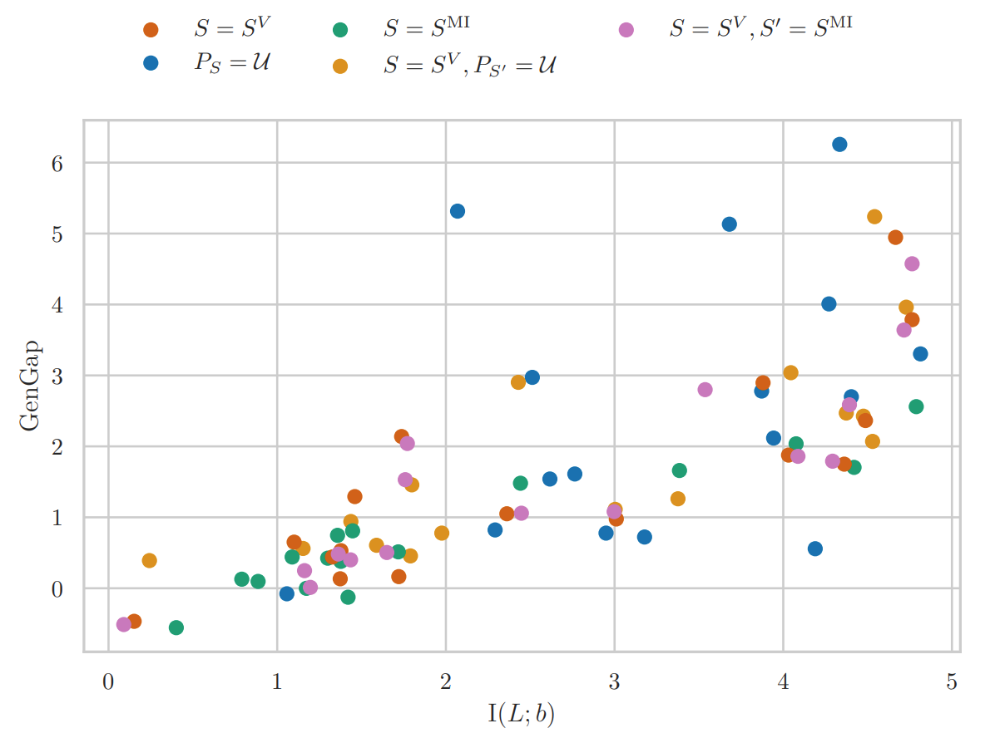
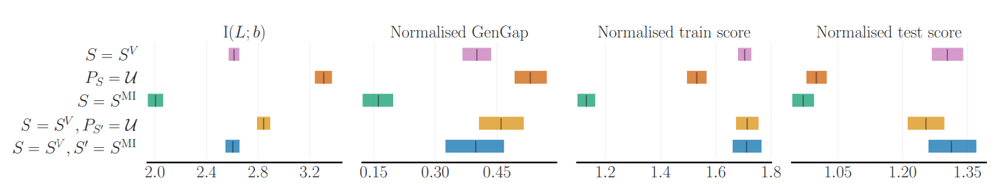

# Prioritized Level Replay with Mutual Information Minimisation

This is a fork of the [Prioritized Level Replay](https://github.com/facebookresearch/level-replay) Pytorch implementation.
It can be used to reproduce the procgen experiments in [DRED](https://arxiv.org/abs/2402.03479).

This fork makes the following changes. The changes were only tested in Procgen but should work in MiniGrid as well.
- Implementation of a level classifier predicting the current level identity from the agent's internal representation. This classifier can be used to measure the mutual information between the level identity and the agent's learned representations.
- Implementation of `instance_pred_log_prob`, a level scoring function minimising this mutual information. 
- Support for sampling strategies mixing two different level scoring functions.

[Prioritized Level Replay](https://arxiv.org/abs/2010.03934) is a simple method for improving generalization and sample-efficiency of deep RL agents on procedurally-generated environments by adaptively updating a sampling distribution over the training levels based on a score of the learning potential of replaying each level. 


## Requirements and Installation
```
conda create -n level-replay-mutual-info python=3.8
conda activate level-replay-mutual-info

git clone https://github.com/francelico/level-replay-mutual-info.git
cd level-replay-mutual-info
pip install -r requirements.txt

# Clone a level-replay-compatible version of OpenAI Baselines.
git clone https://github.com/minqi/baselines.git
cd baselines 
python setup.py install
pip install protobuf==3.20
cd ..

# Clone level-replay-compatible versions of Procgen and MiniGrid environments.
git clone https://github.com/minqi/procgen.git
cd procgen 
python setup.py install
cd ..

git clone https://github.com/minqi/gym-minigrid .git
cd gym-minigrid 
pip install -e .
cd ..
```

Note that you may run into cmake finding an incompatible version of g++. You can manually specify the path to a compatible g++ by setting the path to the right compiler in `procgen/procgen/CMakeLists.txt` before the line `project(codegen)`:
```
...
# Manually set the c++ compiler here
set(CMAKE_CXX_COMPILER "/share/apps/gcc-9.2.0/bin/g++")

project(codegen)
...
```

If you run into further issues when installing procgen, you may be missing some libraries. With sudo privileges you can run
```
sudo apt install -y qtcreator qtbase5-dev qt5-qmake cmake libqt5gui5
ln -sf /usr/lib/x86_64-linux-gnu/libstdc++.so.6 $CONDA_PREFIX/lib/libstdc++.so.6
```

Without sudo privileges you can install the missing libraries using conda:
```
conda install anaconda::cmake
conda install pyqt qtpy

mkdir -p $CONDA_PREFIX/etc/conda/activate.d
mkdir -p $CONDA_PREFIX/etc/conda/deactivate.d
touch $CONDA_PREFIX/etc/conda/activate.d/env_vars.sh
touch $CONDA_PREFIX/etc/conda/deactivate.d/env_vars.sh
echo -e "export OLD_LD_LIBRARY_PATH=${LD_LIBRARY_PATH}\nexport LD_LIBRARY_PATH=$CONDA_PREFIX/lib:${LD_LIBRARY_PATH}" > $CONDA_PREFIX/etc/conda/activate.d/env_vars.sh
echo -e "export LD_LIBRARY_PATH=${OLD_LD_LIBRARY_PATH}\nunset OLD_LD_LIBRARY_PATH" > $CONDA_PREFIX/etc/conda/deactivate.d/env_vars.sh
ln -sf /usr/lib/x86_64-linux-gnu/libstdc++.so.6 $CONDA_PREFIX/lib/libstdc++.so.6
```

If installation issues persist, the following might help:
```
cd $CONDA_PREFIX/lib
mv libstdc++.so.6.0.29 libstdc++.so.6
conda install -c anaconda git
```

## Examples
### Train PPO with mutual information minimisation and rank prioritization on BigFish
```
python -m train --env_name bigfish \
--num_processes=64 \
--level_replay_strategy='instance_pred_log_prob' \
--level_replay_score_transform='rank' \
--level_replay_temperature=0.1 \
--staleness_coef=0.1
```

## Results
Our experiments highlight that the generalisation gap reduction achieved by adaptive sampling strategies depends on how well they minimise the mutual information between the training level identities and the agent's learned representations. We report a marked positive correlation ($\rho=0.6$) between mutual information and the generalisation gap across procgen games. Each dot below represents a particular sampling strategy and Procgen game, aggregated over five seeds.



This results in a similar correlation being present after aggregating PPO-normalised scores across games.



## Additional resources

- The code and data to reproduce the procgen results and figures from [our paper](https://arxiv.org/abs/2402.03479) can be downloaded from [our data repository](TODO).
- The Pytorch implementation for Data-Regularised Environment Design (DRED) can be accessed from [our DRED repository](https://github.com/uoe-agents/dred).
- The original Prioritized Level Replay code can be accessed from [the original repository](https://github.com/facebookresearch/level-replay).
- The PPO implementation is largely based on [Ilya Kostrikov's implementation](https://github.com/ikostrikov/pytorch-a2c-ppo-acktr-gail) and [Roberta Raileanu's specific integration with Procgen](https://github.com/rraileanu/auto-drac).

## Citation
If you make use of this code or results in your own work, please cite our paper:
```bib
@misc{garcin2024dred,
      title={DRED: Zero-Shot Transfer in Reinforcement Learning via Data-Regularised Environment Design}, 
      author={Samuel Garcin and James Doran and Shangmin Guo and Christopher G. Lucas and Stefano V. Albrecht},
      year={2024},
      eprint={2402.03479},
      archivePrefix={arXiv},
      primaryClass={cs.LG}
}
```
as well as the original Prioritized Level Replay paper:
```bib
@misc{jiang2020prioritized,
      title={{Prioritized Level Replay}}, 
      author={Minqi Jiang and Edward Grefenstette and Tim Rockt\"{a}schel},
      year={2020},
      eprint={2010.03934},
      archivePrefix={arXiv},
      primaryClass={cs.LG}
}
```